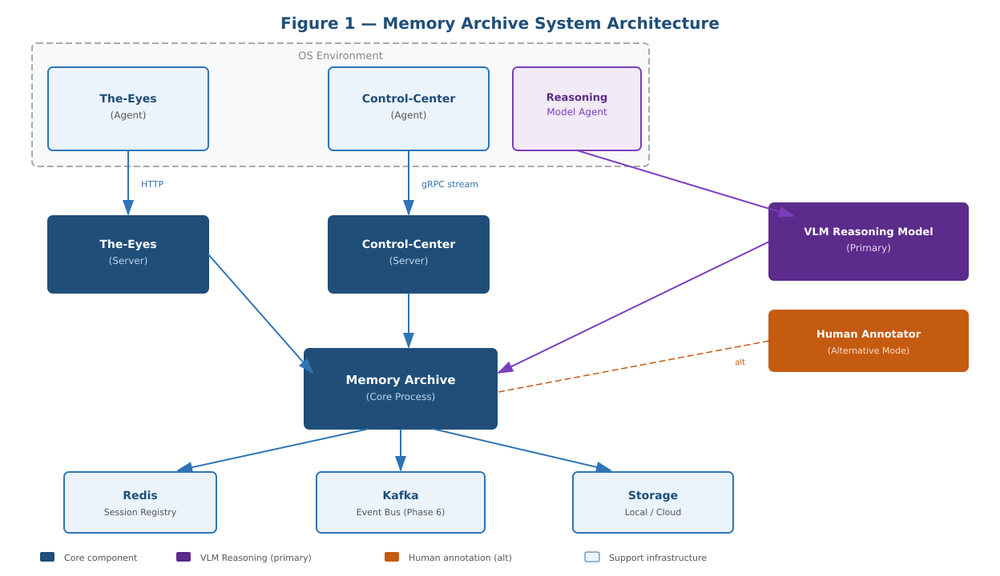
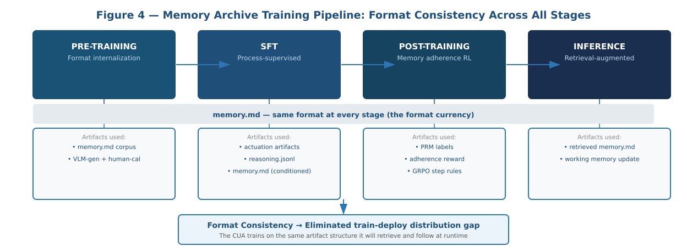
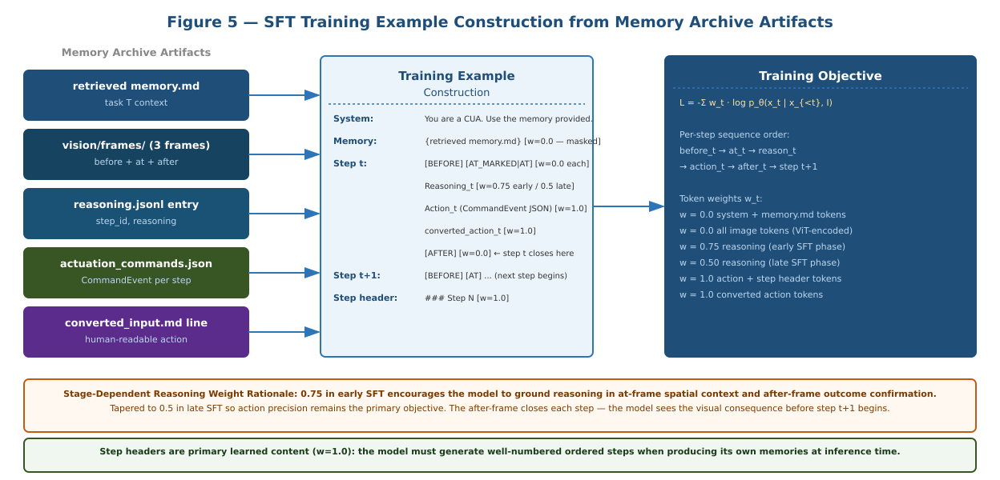
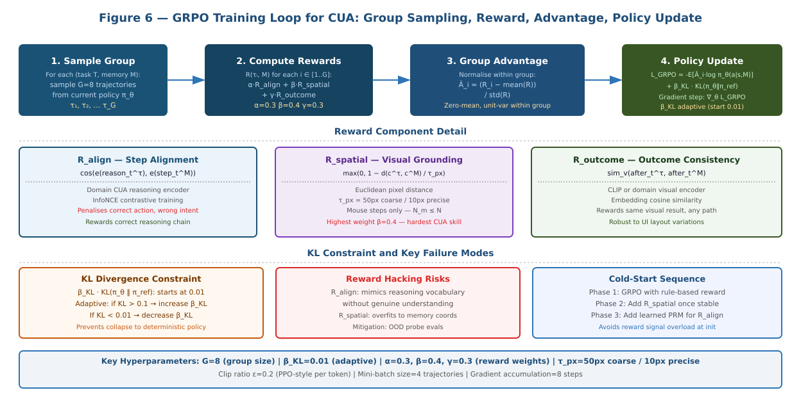
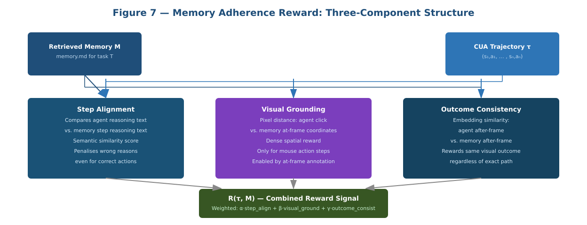
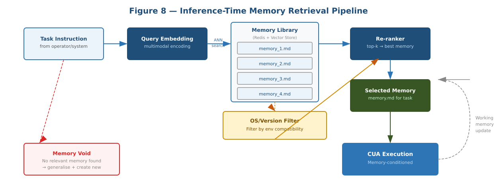
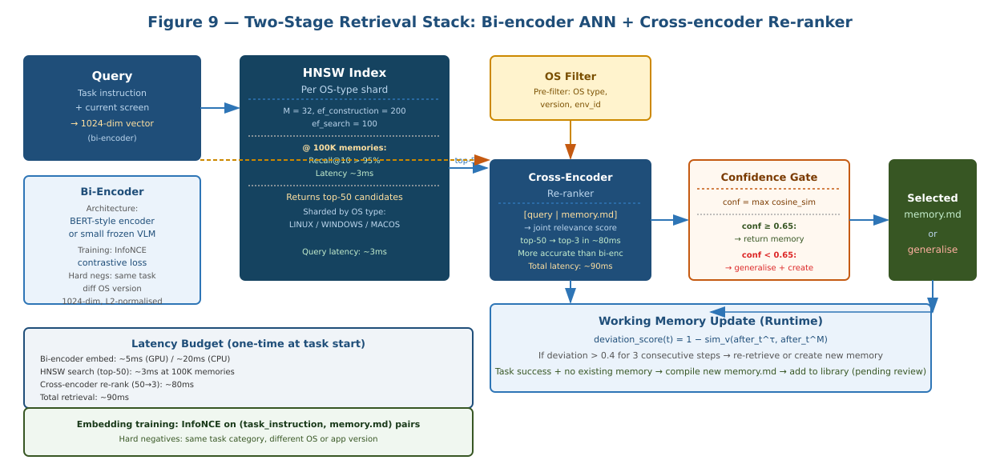
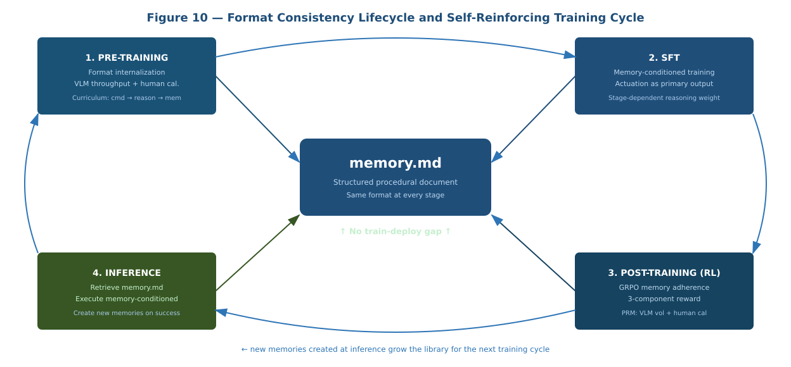

# Memory Archive: A Memory-Grounded Training Paradigm for Computer Use Agents

[](LICENSE)
[](https://doi.org/10.5281/zenodo.20176599)
[](https://github.com/nullvoider07/Memory-Archive)
[](memory_archive.pdf)

**Kartik . A** · Independent Researcher · Project Dockyard

📄 [Read the Paper (PDF)](memory_archive_paradigm.pdf) &nbsp;·&nbsp; 💻 [Memory Archive Tool](https://github.com/nullvoider07/Memory-Archive)

> **Publication note:** As an independent researcher, this architecture is published as an open-science preprint via Zenodo (CERN) to establish formal prior art. A permanent, globally recognised DOI is attached to this work. The full paper is available here in both PDF and Markdown.

---

## The Problem

The dominant CUA training pipeline trains on `(screenshot, action)` pairs and deploys with plain-text prompts and retrieved documents the model has never seen during training. Every task boundary is a distribution shift. Binary outcome rewards provide no per-step signal. Every execution is zero-shot regardless of prior experience with the same task.

## The Central Thesis

> **Format consistency eliminates the train-deploy distribution gap.**
>
> The `memory.md` artifact — a structured procedural document with per-step reasoning, actuation commands, and image references — is the same object at pre-training, supervised fine-tuning, post-training RL, and inference. The model trains on exactly what it retrieves at runtime. Additionally, the trained model generates its own `memory.md` at inference time, growing the library continuously and providing a multi-dimensional evaluation signal during training without any external benchmark.

---

## Abstract

Memory Archive produces a structured, annotated dataset comprising per-step actuation records, process-level reasoning annotations, visual state triples, and compiled task guides called memories. This data is used across all four stages of the CUA training and deployment lifecycle: pre-training, supervised fine-tuning, post-training reinforcement, and inference-time retrieval. Reasoning annotations are produced by a VLM Reasoning Model as the primary source, with human annotation as an alternative mode. The paper covers all four training stages at full technical depth — mathematical formulations, actuation artifact treatment, data construction pipelines, algorithm specifications, hyperparameter guidance, and failure mode analysis. A fifth section covers self-generated memory as an in-training evaluation mechanism.

---

## System Architecture

<div align="center">



*Memory Archive connects to Control-Center (actuation via gRPC), The-Eyes (screen capture via HTTP), and a VLM Reasoning Model. Both the VLM (primary) and human annotator (alternative) produce the same schema in `reasoning.jsonl`.*

</div>

---

## The Four Training Stages

<div align="center">



*`memory.md` threads through all four stages as the shared format currency — the same artifact the model retrieves and follows at inference.*

</div>

### Stage 1 — Pre-Training: Format Internalization

The base model learns what a well-formed memory looks like, how step sections are structured, and how image references relate to actuation commands — before any task-specific fine-tuning.

**Data mix:** `memory.md` documents (40%) · `reasoning.jsonl` + image triples (30%) · actuation command files (20%) · general GUI screenshots (10%)

**3-phase curriculum:** actuation vocabulary → step-level visual-intent alignment → full compiled memories

---

### Stage 2 — SFT: Actuation as a First-Class Target

SFT uses **Formulation B** — a retrieved `memory.md` is in context at every training step. The model learns to read and follow a memory at train time, not just at inference.

**Key design:** `CommandEvent JSON` and step headers are full-weight targets (`w = 1.0`). Reasoning uses stage-dependent weighting (0.75 early → 0.50 late). Memory tokens are masked entirely (`w = 0.0`).

<div align="center">



*All Memory Archive artifacts assembled into a single multi-step training sequence.*

</div>

---

### Stage 3 — Post-Training RL: Memory Adherence

**Algorithm:** GRPO — eliminates a separate value network, critical given 150+ image encodings per session in the KV cache.

**Three-component reward** ($G = 8$ trajectories per task):

| Component | Weight | What it measures |
|---|---|---|
| $R_{\text{align}}$ — Step Alignment | $\alpha = 0.3$ | Cosine similarity between agent reasoning and memory step text (domain-specific CUA encoder) |
| $R_{\text{spatial}}$ — Visual Grounding | $\beta = 0.4$ | Euclidean pixel distance: agent click vs memory at-frame annotation |
| $R_{\text{outcome}}$ — Outcome Consistency | $\gamma = 0.3$ | Visual encoder similarity between agent after-frame and memory after-frame |

$R_{\text{spatial}}$ carries the highest weight — spatial precision is the hardest CUA skill to acquire from language supervision alone.

<div align="center">





</div>

---

### Stage 4 — Inference: Retrieval-Augmented Execution

<div align="center">





</div>

**Two-stage retrieval:** Bi-encoder HNSW (top-50 in ~3ms) → cross-encoder re-ranker (top-3 in ~80ms). Confidence gate at 0.65. OS/version pre-filter prevents stale memories.

**Working memory update:** deviation from the retrieved memory is tracked per step. Three consecutive steps with deviation score > 0.4 triggers re-retrieval or new memory creation.

**New memory creation:** on task success in the generalisation path, the full execution trajectory is compiled into a new `memory.md` and added to the library — growing it endogenously each cycle.

<div align="center">



*New memories created at inference and self-generated memories passing quality review both feed back into the pre-training corpus.*

</div>

---

## Self-Generated Memory as In-Training Evaluation

At training checkpoints, the model produces its own `memory.md` through live CUA sessions. This gives four diagnostic signals without any external benchmark:

| Signal | Detects | Threshold |
|---|---|---|
| MinHash LSH similarity to training memories | Overfitting | > 0.85 flags verbatim reproduction |
| Step count completeness + causal connective density | Underfitting | Monitored across training |
| Entity overlap: reasoning vs at/after frames | Context-awareness | > 0.75 average |
| Step count ratio < 1.0 vs human baseline | Super-human performance | Flagged for human review |

---

## Comparison with Existing CUA Approaches

| System | Process Labels | Memory at Inference | Format Consistency |
|---|---|---|---|
| Behavioral Cloning | None | None | Low |
| UI-TARS / OpenCUA-32B | Synthetic CoT | None | Medium |
| ICAL | VLM-abstracted | Retrieved (implicit) | High |
| HyMEM | None | Graph-structured | Medium |
| SkillRL | Distilled skills | Hierarchical skills | Medium |
| **Memory Archive** | **VLM-gen + human cal** | **`memory.md` (same as training)** | **High — all stages identical** |

---

## Memory Archive Tool

The data collection system that generates the training corpus described in this paper is developed as part of **Project Dockyard**.

👉 **[github.com/nullvoider07/Memory-Archive](https://github.com/nullvoider07/Memory-Archive)**

---

## Citation

```bibtex
@misc{kartik2026memoryarchive,
  title        = {Memory Archive: A Memory-Grounded Training Paradigm
                  for Computer Use Agents},
  author       = {Kartik A.},
  year         = {2026},
  howpublished = {Project Dockyard},
  doi          = {10.5281/zenodo.20176599},
  note         = {Independent Research. Preprint available at Zenodo:
                  \url{https://doi.org/10.5281/zenodo.20176599}}
}
```

---

## License

This work is licensed under the [CC-BY-NC 4.0](LICENSE).

© 2026 Kartik A. · Project Dockyard